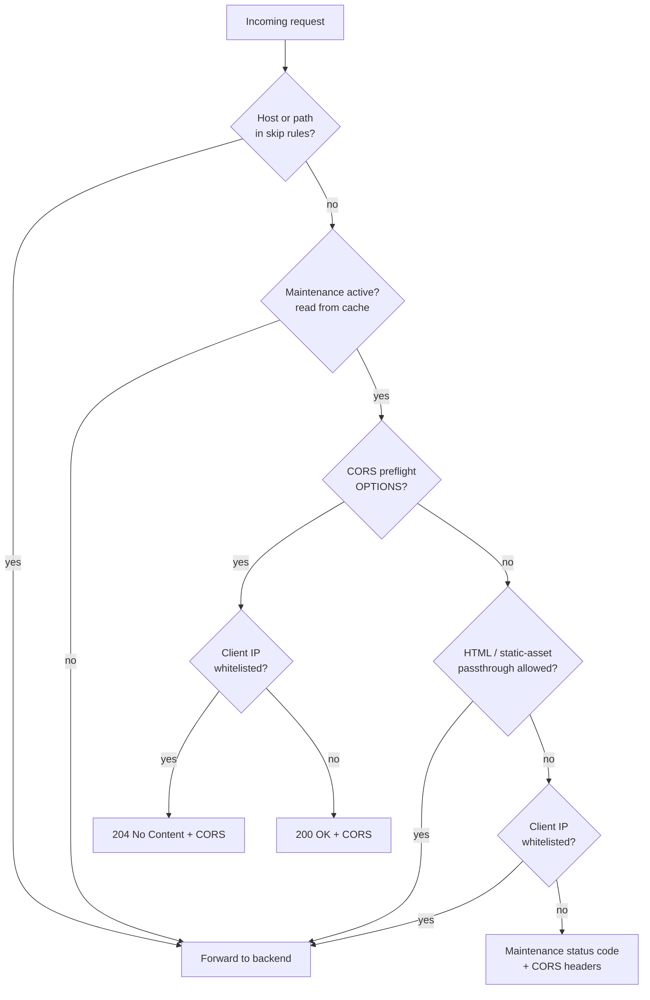

# Traefik Maintenance Plugin

<p align="center">
  <a href="https://github.com/CitronusAcademy/traefik-maintenance-plugin/actions/workflows/ci.yml"></a>
  <a href="https://codecov.io/gh/CitronusAcademy/traefik-maintenance-plugin"></a>
  <a href="go.mod"></a>
  <a href="LICENSE"></a>
</p>

A Traefik middleware plugin that puts a service into maintenance mode. It polls a
configurable HTTP API in the background for maintenance status and an IP whitelist, and
blocks requests while maintenance is active — except for whitelisted clients and any paths
or hosts you choose to exempt.

## Table of contents

- [Quick start](#quick-start)
- [How it works](#how-it-works)
- [Features](#features)
- [Installation](#installation)
- [Configuration](#configuration)
- [API contract](#api-contract)
- [Client IP detection](#client-ip-detection)
- [Parameters](#parameters)
- [Operational notes](#operational-notes)
- [Development](#development)

## Quick start

**1. Register the plugin** in Traefik's static configuration:

```yaml
experimental:
  plugins:
    maintenanceCheck:
      moduleName: github.com/CitronusAcademy/traefik-maintenance-plugin
      version: "v1.0.0"
```

**2. Attach the middleware** to your router (Kubernetes CRD shown):

```yaml
apiVersion: traefik.io/v1alpha1
kind: Middleware
metadata:
  name: maintenance-check
spec:
  plugin:
    maintenanceCheck:
      environmentEndpoints:
        "": "https://maintenance-api.example.com/v1/configurations/"
```

**3. Serve maintenance state** from that endpoint as JSON:

```json
{ "system_config": { "maintenance": { "is_active": false, "whitelist": [] } } }
```

With `is_active: false` every request flows through untouched. Flip it to `true`
and each request receives the maintenance response — except whitelisted IPs and any
paths or hosts you exempt. See [Configuration](#configuration) for the full option set
and [Operational notes](#operational-notes) before relying on it in production.

## How it works

A background goroutine polls the maintenance API every `cacheDurationInSeconds` and stores
the result (status + whitelist) in an in-memory cache. **Requests only ever read that
cache**, so the API is never on the request path. Each request is then evaluated like this:



## Features

- Reads maintenance status from a configurable HTTP API endpoint.
- Refreshes status in the background at a configurable interval — **the request path never
  calls the API**, so there is no per-request latency.
- IP whitelist with CIDR ranges and a `*` wildcard to allow all traffic.
- Per-environment routing: map domain suffixes to different API endpoints, each with its
  own cached state and secret header.
- Skip rules: bypass maintenance for specific URL prefixes or hosts (hosts support
  `*.example.com` wildcards).
- Optional passthrough of base HTML pages and/or static assets while keeping APIs blocked.
- CORS support for preflight and blocked responses, with an optional origin allow-list.
- Configurable maintenance status code and request timeout.
- Graceful fallback to the last cached value when the API is unavailable.

## Installation

Register the plugin in Traefik's static configuration:

```yaml
experimental:
  plugins:
    maintenanceCheck:
      moduleName: github.com/CitronusAcademy/traefik-maintenance-plugin
      version: "v1.0.0"
```

## Configuration

Middleware (Kubernetes CRD) example:

```yaml
apiVersion: traefik.io/v1alpha1
kind: Middleware
metadata:
  name: maintenance-check
  namespace: default
spec:
  plugin:
    maintenanceCheck:
      environmentEndpoints:
        "": "https://maintenance-api.example.com/v1/configurations/"
      environmentSecrets:
        "":
          header: "X-Plugin-Secret"
          value: "your-secret-token"
      cacheDurationInSeconds: 10
      requestTimeoutInSeconds: 5
      maintenanceStatusCode: 512
      skipPrefixes:
        - "/admin"
      skipHosts:
        - "admin.example.com"
        - "*.internal.example.com"
      allowHTMLWhenMaintenance: false   # default: true; set false to block HTML pages too
      allowStaticExtensions:
        - ".js"
        - ".css"
        - ".svg"
        - ".ico"
      allowedOrigins: []   # empty = reflect any Origin; see Operational notes
      debug: false
```

### Environment-based endpoint selection

`environmentEndpoints` maps a domain suffix to a maintenance API endpoint. The plugin picks
the **longest matching suffix** for the request host; the empty-string key `""` is the
default fallback. Each suffix gets its own independently-cached maintenance state, so a
single Traefik instance can serve several environments with separate maintenance switches:

```yaml
environmentEndpoints:
  ".staging": "https://maintenance-staging.example.com/v1/configurations/"
  ".dev":     "https://maintenance-dev.example.com/v1/configurations/"
  "":         "https://maintenance-api.example.com/v1/configurations/"
```

If you only need one environment, configure just the `""` key. When no
`environmentEndpoints` are supplied at all, the plugin falls back to a single default
endpoint of `http://maintenance-service/v1/configurations/`, which you will almost always
want to override.

## API contract

The maintenance API must return JSON in this shape:

```json
{
  "system_config": {
    "maintenance": {
      "is_active": false,
      "whitelist": ["192.168.1.1", "10.0.0.0/16", "*"]
    }
  }
}
```

When `is_active` is `true`, only clients matching the `whitelist` are allowed through;
everyone else receives the configured maintenance status code. A `"*"` entry allows all
clients. Whitelist entries may be exact IPs or CIDR ranges.

### Secret-gated whitelist (optional)

If the same API is also called by a frontend to display a maintenance banner, you may want
the frontend to see only `is_active` while the plugin additionally receives the `whitelist`.
Configure a secret header and have the API return the `whitelist` only when it is present
and matches:

```yaml
secretHeader: "X-Plugin-Secret"
secretHeaderValue: "your-secret-token"
```

Per-environment secrets via `environmentSecrets` take precedence; the top-level
`secretHeader`/`secretHeaderValue` is the fallback when an environment has no secret value.

## Client IP detection

The plugin determines the client IP from the **`Cf-Connecting-Ip` header only**. This is
intended for deployments behind Cloudflare, where that header is injected by the edge.
There is no `X-Forwarded-For` / `RemoteAddr` fallback.

**Consequence:** if a request reaches the plugin without a `Cf-Connecting-Ip` header, the
plugin resolves no client IP, so whitelisting cannot match and the client is **blocked**
while maintenance is active. Ensure every path that needs whitelisting actually carries
that header before it reaches Traefik.

## Parameters

| Parameter | Type | Default | Description |
|-----------|------|---------|-------------|
| `environmentEndpoints` | `map[string]string` | `{"": "http://maintenance-service/v1/configurations/"}` | Domain suffix → API endpoint. Longest-suffix match wins; `""` is the fallback. |
| `environmentSecrets` | `map[string]{header,value}` | `{"": {"X-Plugin-Secret", ""}}` | Domain suffix → secret header sent to that environment's API. |
| `cacheDurationInSeconds` | `int` | `10` | Background poll interval. **Not** a per-request cache. |
| `requestTimeoutInSeconds` | `int` | `5` | Timeout for each maintenance API request. |
| `maintenanceStatusCode` | `int` | `512` | HTTP status returned to blocked clients during maintenance. |
| `skipPrefixes` | `[]string` | `[]` | URL path prefixes that always bypass maintenance. |
| `skipHosts` | `[]string` | `[]` | Hostnames that always bypass maintenance; supports `*.example.com`. |
| `allowHTMLWhenMaintenance` | `bool` | `true` | Allow GET/HEAD requests that accept `text/html` (lets a status page load while APIs stay blocked). |
| `allowStaticExtensions` | `[]string` | `.js .css .svg .ico .png .jpg .jpeg .gif .webp .woff .woff2 .ttf .map` | File extensions allowed for GET/HEAD during maintenance. |
| `strictAssetMatching` | `bool` | `false` | When `true`, match `allowStaticExtensions` against the URL's real file extension (`path.Ext`), so `/data.json/x` is not treated as static. |
| `allowedOrigins` | `[]string` | `[]` | CORS origin allow-list. See **Operational notes** for the credentials behavior. |
| `corsAllowAnyOrigin` | `bool` | `true` | When `allowedOrigins` is empty: `true` reflects any `Origin` (no credentials); `false` sends no CORS origin header. |
| `trustedProxies` | `[]string` | `[]` | CIDR ranges for trusted direct peers. When set, `Cf-Connecting-Ip` is honored only if `RemoteAddr` falls in one of them. Empty = trust unconditionally. |
| `secretHeader` / `secretHeaderValue` | `string` / `string` | `X-Plugin-Secret` / `""` | Fallback secret used when an environment has no per-environment secret. |
| `debug` | `bool` | `false` | Verbose stdout logging. See the warning in **Operational notes**. |

## Operational notes

These are the non-obvious behaviors worth knowing before relying on the plugin.

- **Secret mismatch blocks everyone.** If the API gates the `whitelist` behind the secret
  (see above) and the plugin's configured secret does not match what the API expects, the
  response carries `is_active` with **no `whitelist`** — so during maintenance *every*
  client, including operators you meant to allow, is blocked. If "the whitelist isn't
  working," verify the plugin's effective secret matches the API's expected value first.

- **The cache is per Traefik replica.** Each replica polls and converges independently. With
  more than one replica, immediately after a whitelist/maintenance change a load-balanced
  client can be routed to a replica that hasn't refreshed yet, so the maintenance response
  can flicker for up to one `cacheDurationInSeconds` window. Single-replica deployments do
  not see this.

- **`debug: true` logs request headers to stdout.** Sensitive headers —
  `Authorization`, `Cookie`, `Set-Cookie`, `Proxy-Authorization`, and every
  configured secret header — are redacted to `[REDACTED]`; all other headers are
  logged verbatim. Still keep it off in any shared or production environment.

- **CORS credentials require an explicit origin allow-list.** With `allowedOrigins`
  empty, the plugin reflects whatever `Origin` the request sent but does **not** send
  `Access-Control-Allow-Credentials` — reflecting an arbitrary origin together with
  credentials is the insecure CORS combination. Only origins you list explicitly in
  `allowedOrigins` receive `Access-Control-Allow-Credentials: true`.

- **Fail-open on API errors.** If the API is unreachable or returns an error, the plugin
  keeps serving the last cached state and retries with exponential backoff. On a cold start
  where the very first fetch fails, no prior state exists and the plugin treats maintenance
  as inactive (allows traffic) until a fetch succeeds.

## Development

```bash
go build ./...
go test ./...
go test -race ./...        # race detector
go test -cover ./...       # statement coverage (also reported to Codecov in CI)
go vet ./...
gofmt -l .
```

The plugin has **no external dependencies** — it uses only the Go standard library, which
keeps it compatible with Traefik's Yaegi interpreter.

## License

MIT — see [LICENSE](LICENSE).
